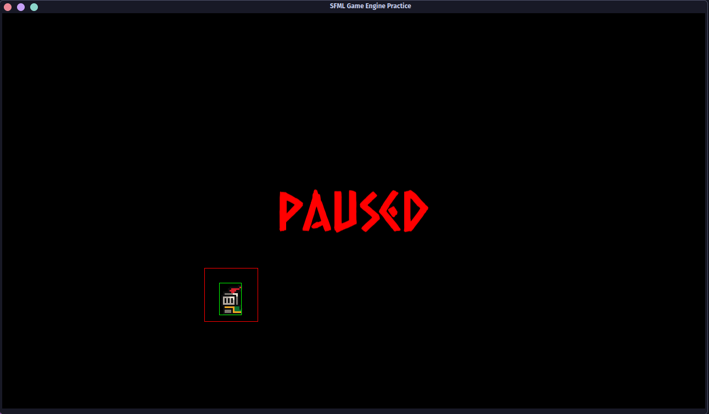

# C++ Game Development Template
This is a template I've created for myself to practice game development. It in no way is intended as
a 2D 'engine' for general use -- but it does contain things similar to 'engines' like various managers,
an ECS system, various utilities, and relies on state-management for 'scenes'. I will be forking this as a foundation for prototyping game ideas and you are welcome to as well! Things I hope to incorporate 
in the future (in some order):
* LDtk
* ImGUI
* Box2D

## Practice with SFML 3.0 & CMake

One main purpose of this repo is practicing C++ game development concepts using [SFML 3](https://github.com/SFML/SFML), CMake, and other libraries like [EnTT](https://github.com/skypjack/entt) and [toml++](https://github.com/marzer/tomlplusplus). In my last project, refactoring to add features later led to the expected nightmare that happens when I followed the thought: "Meh,
I'll write that if I need it later. I'd rather keep this simple and easy for now." So this practice project is a direct
consequence of that experience!

After a bit of study, I've also learned some fun acronyms like "YAGNI" so I am also trying to balance the above sentiment with the practice of not over-engineering solutions to problems I don't have yet. Granted, the purpose of this project is to learn architecture patterns SO there might/will probably be some "overkill" stuff.

### Architecture

The main goal is to implement a robust and scalable architecture from the start. The current implementation focuses on two primary architectural patterns:

*   **Entity-Component-System (ECS):** Using the [EnTT](https://github.com/skypjack/entt) library, this project adopts the ECS pattern to decouple game entities from their data and logic. This allows for a more flexible and data-oriented design.
*   **State Machine:** A finite state machine is used to manage the different states of the application (e.g., Main Menu, Playing, Paused). This keeps the logic for each state contained and easy to manage.

### Managers

To handle common game-related tasks and resources, several manager classes have been implemented. These are bundled into a single `AppContext` struct that is passed to different parts of the application, like game states, to provide access to shared resources without using globals.

*   **`StateManager`**: Manages the stack of game states (e.g., `MainMenu`, `Playing`).
*   **`WindowManager`**: A wrapper for the `sf::RenderWindow` to handle window creation and events.
*   **`ResourceManager`**: A generic manager for loading and storing shared resources like textures and fonts to prevent redundant loading from disk.
*   **`ConfigManager`**: Manages loading and accessing configuration data from files (e.g., using [toml++](https://github.com/marzer/tomlplusplus)).
*   **`GlobalEventManager`**: A simple event bus for broadcasting events across different systems.

### ECS (Entity-Component-System)

The project uses the **EnTT** library to implement an ECS architecture. This pattern separates data from logic, leading to a "data-oriented design". I'm practicing using it for game entities as well as UI elements. The core parts of the ECS implementation are:

*   **`Components.hpp`**: This header-only file defines all the components. Components are simple data structures (structs) that hold information but no logic (e.g., `Position`, `Velocity`, `Renderable`).
*   **`EntityFactory`**: A factory class responsible for constructing pre-defined game entities (prefabs). It simplifies entity creation by assembling a specific set of components and assigning them to a new entity (e.g., creating a "Player" entity with `Position`, `Velocity`, and `Input` components).
*   **`Systems.cpp`**: This file contains the game's logic. Systems are functions or classes that iterate over entities with specific sets of components and perform updates/operations/etc.

### Utilities

*   **`Logger.hpp`**: Simple logger that makes use of std::print and std::source_location. Prints Info/Warning/Error to console with ANSI colors. Flags are set to only print Error for release builds.
*   **`RandomMachine`**: A utility class for generating random numbers.

## Build & Dependencies

The project is built using CMake with a single `CMakeLists.txt` in the root directory. I've built it in both Windows and (Arch) Linux with no problems. 

*   [**SFML 3.0.2**](https://github.com/SFML/SFML): Used for graphics, windowing, and audio.
*   [**EnTT**](https://github.com/skypjack/entt): For the ECS architecture.
*   [**toml++**](https://github.com/marzer/tomlplusplus): For parsing TOML configuration files.
