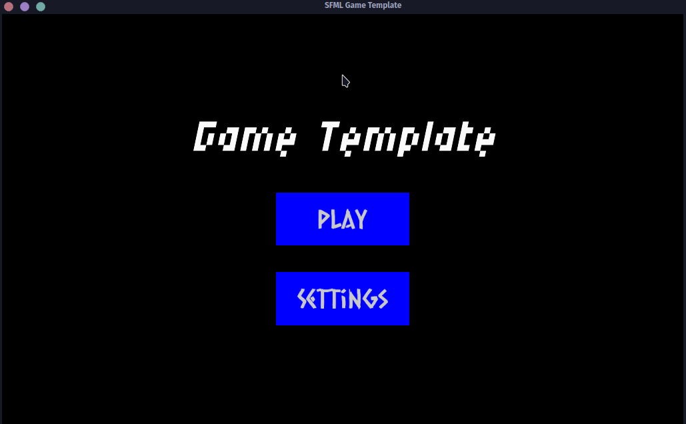

# SFML 3 Game Template
A modern, data-oriented C++23 starter template for game development using SFML 3.

This is a work-in-progress template I've created to practice C++ game development. While not a robust 2D 'game engine', it does provide things similar to simple engines: an ECS framework, a state machine for managing game scenes, various managers, and a few utilities (e.g., async logger, random machine, etc.). The goal is to provide a foundation to help speed up prototyping and developing games using SFML 3.

### Examples
Projects made with this template:

* [Breakdown](https://github.com/nantr0nic/breakdown) - A breakout game where the bricks begin to descend.

---
1. [Features](#features)
	1. [Architecture](#architecture)
	2. [ECS](#entity-component-system)
	3. [Managers](#managers)
	4. [Utilities](#utilities)
2. [Getting Started](#getting-started)
3. [Build & Dependencies](#build--dependencies)
4. [Keymap](#keymap)
5. [Next Steps](#next-steps)

---

## Features
### Architecture

One goal of this template is to implement a robust and scalable architecture from the start. 
The current implementation focuses on the following architectural patterns:

*   **Entity-Component-System (ECS):** Using the [EnTT](https://github.com/skypjack/entt) library, this project adopts the ECS pattern to decouple game entities from their data and logic. This allows for a more flexible and data-oriented design. This avoids the (often confusing) deep inheritance hierarchies common in traditional object-oriented game design. The ECS system is also used to create and manage GUI elements.
*   **State Machine:** A stack-based finite state machine is used to manage the different states of the application (e.g. Main Menu, Play State, Settings Menu, etc.). This keeps the logic for each state contained, easy to manage, and allows for easy overlays.
*   **Service Locator Pattern:** ```AppContext``` serves as a centralized hub for all major engine components, including Managers, the ECS Registry, and global AppData.
*   **Data-oriented Configuration:** Rather than hard-coding values into source files, this template uses TOML files for manifest loading resources and handling game configuration externally. This allows you to tweak game constants or swap textures without recompiling the entire C++ codebase.
*   **Cross-platform:** This template uses the CMake build system and compiles on Windows and Linux systems.

### Entity-Component-System

The project uses the **EnTT** library to implement an ECS architecture. The core parts of the ECS implementation are:

*   **`Components.hpp`**:  Components are simple data structures (structs) that hold information but no logic (e.g., `Position`, `Velocity`, `Renderable`). These are used to define entities within the EnTT registry.
*   **`EntityFactory`**: A factory class responsible for constructing pre-defined game entities (prefabs). It simplifies game entity creation by assembling a specific set of components and assigning them to a new entity (e.g., creating a "Player" entity with `Position`, `Velocity`, and `Input` components). Also used for creating GUI elements.
*   **`Systems.cpp`**: This file contains the game's logic. Systems are functions or classes that iterate over entities with specific sets of components and perform updates/operations/etc. It is separated into CoreSystems (game mechanics) and UISystems.

### Managers

To handle common game-related tasks and resources, several manager classes have been implemented. Following the Service Locator pattern, these are bundled into a single `AppContext` struct that is passed by reference to game states and systems, providing a centralized, non-global hub. The managers include:

*   **`StateManager`**: Manages the 'stack' (a vector) of game states (e.g., `MainMenu`, `Playing`).
*   **`ResourceManager`**: A centralized, exception-free asset manager. Supports ```sf::Texture```, ```sf::Font```, ```sf::SoundBuffer```, and ```sf::Music``` with automatic manifest-based loading. 
> An ```AssetsManifest.toml``` file is provided to help manage resources and enable swapping asset files without needing to re-compile. An ```AssetKeys.cpp``` file is provided to help centralize resource names to help prevent typo/copy-paste errors.
*   **`ConfigManager`**: Manages loading and accessing configuration data from files using [toml++](https://github.com/marzer/tomlplusplus).
*   **`WindowManager`**: A wrapper for the `sf::RenderWindow` to handle window creation and events.
*   **`GlobalEventManager`**: A simple event manager for broadcasting events across different systems.

### Utilities

*   **Logger**: An asynchronous logger that makes use of std::print and std::source_location. It can print Info/Warning/Error to console with ANSI colors, log to file, or both.
> **CMake Integration:** Logging to file can be set in CMakeLists.txt, or ```-DLOG_TO_FILE=ON``` can be used during builds.
*   **RandomMachine**: A thread-safe utility class for generating random numbers.
*   **Utils:** Includes helper functions such as automated sprite padding calculations, letterboxing (```boxView```), and parsing color values from file with safety clamping.

## Getting Started
### Using as a GitHub Template
If you create a new repository using the "Use this template" feature, an automated GitHub Action will trigger to handle renaming and cleaning up the template for you.
1. **Create your Repo**: Click the "Use this template" button in the top-right of this page and select "Create a new repository".
2. **Name your project**: Give your project a name (e.g., my-new-game).
3. **Wait for automation**: After the repository is created, the Template Cleanup GitHub Action will automatically run. It renames the project folders, updates the ```CMakeLists.txt``` targets, and set the window title in ```WindowConfig.toml``` to match your new repo name. It will also replace this README with a generic starter version and remove template-specific assets like the ```screenshots/``` folder.
4. **That's it!** Ready to go. You can clone to your local machine and start building.

### If you don't want to use the template feature or host your repo on GitHub
You *can* clone the repo or download the source code as usual, however, that will involve renaming stuff on your own which might be a little messy and error prone. It is still suggested to create a new repo using the template feature described above to take advantage of the automated renaming. You can then pull the code to your local machine and host it elsewhere if desired.

## Build & Dependencies
* This project requires a **C++23** compatible compiler (GCC 13+, Clang 16+, MSVC 19.35+).

The project is built using CMake with a single `CMakeLists.txt` in the root directory. CMake will fetch the following dependencies:

*   [**SFML 3.0.2**](https://github.com/SFML/SFML): Used for graphics, windowing, and audio.
*   [**EnTT**](https://github.com/skypjack/entt): For the ECS architecture.
*   [**toml++**](https://github.com/marzer/tomlplusplus): For parsing TOML configuration files.

To build this project, run the following commands within the ```sfml3-game-template``` folder:
```bash
cmake -S . -B build -DCMAKE_BUILD_TYPE=Release
cmake --build build
```

## Keymap

* **WASD**: Moves the character around
* **P**: Pause/Unpause the game and access settings.
* **F12**: Enable/disable debug (Currently just toggles the sprite boundary boxes.)
* **Escape**: Quit the game

## Next Steps

* **Actual documentation!** I aim to provide thorough documentation of template code and examples to demonstrate its use.
